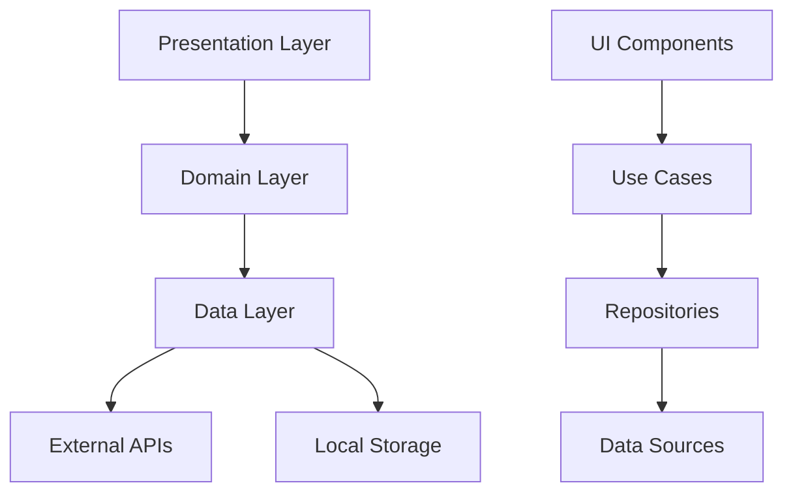

<!--
This README describes the package. If you publish this package to pub.dev,
this README's contents appear on the landing page for your package.

For information about how to write a good package README, see the guide for
[writing package pages](https://dart.dev/tools/pub/writing-package-pages).

For general information about developing packages, see the Dart guide for
[creating packages](https://dart.dev/guides/libraries/create-packages)
and the Flutter guide for
[developing packages and plugins](https://flutter.dev/to/develop-packages).
-->

# 🚀 StarterKit - Flutter Boilerplate Generator

[](https://flutter.dev)
[](https://dart.dev)
[](https://opensource.org/licenses/MIT)

> A comprehensive Flutter boilerplate generator with clean architecture, WeChat-inspired design system, and powerful CLI tools.

## 📋 Table of Contents

- [🌟 Features](#-features)
- [🏗️ Architecture](#️-architecture)
- [🎨 Design System](#-design-system)
- [⚡ Quick Start](#-quick-start)
- [📦 Installation](#-installation)
- [🛠️ CLI Commands](#️-cli-commands)
- [📚 Usage Examples](#-usage-examples)
- [🧩 Components](#-components)
- [🌐 Localization](#-localization)
- [🔧 Configuration](#-configuration)
- [🧪 Testing](#-testing)
- [📖 API Reference](#-api-reference)
- [🤝 Contributing](#-contributing)
- [📄 License](#-license)

## 🌟 Features

### ✨ Core Features
- 🏗️ **Clean Architecture** - Separation of concerns with clear layers
- 🎨 **WeChat-Inspired Design System** - Beautiful, consistent UI components
- 🌐 **Multi-language Support** - Built-in localization for 8+ languages
- 🔧 **CLI Tools** - Automated code generation and project setup
- 📱 **Responsive Design** - Works seamlessly across all screen sizes
- 🔒 **Type Safety** - Full TypeScript-like safety with Dart
- 🧪 **Testing Ready** - Comprehensive test coverage and utilities

### 🛠️ Developer Experience
- ⚡ **Zero Configuration** - Works out of the box
- 🔄 **Hot Reload** - Instant development feedback
- 📝 **Rich Documentation** - Comprehensive guides and examples
- 🎯 **Best Practices** - Industry-standard patterns and conventions
- 🔍 **Linting** - Strict code quality enforcement
- 📊 **Analytics Ready** - Built-in tracking capabilities

## 🏗️ Architecture

StarterKit follows **Clean Architecture** principles with clear separation of concerns:

```
📁 lib/
├── 📁 src/
│   ├── 📁 core/                    # Core functionality
│   │   ├── 📁 config/              # App configuration
│   │   ├── 📁 design_system/       # UI components & themes
│   │   ├── 📁 di/                  # Dependency injection
│   │   ├── 📁 localization/        # Multi-language support
│   │   ├── 📁 network/             # API client & networking
│   │   └── 📁 utils/               # Utility functions
│   ├── 📁 data/                    # Data layer
│   │   ├── 📁 models/              # Data models
│   │   └── 📁 repositories/        # Data repositories
│   ├── 📁 domain/                  # Business logic layer
│   │   ├── 📁 entities/            # Business entities
│   │   ├── 📁 repositories/        # Repository interfaces
│   │   └── 📁 usecases/            # Business use cases
│   └── 📁 presentation/            # UI layer
│       ├── 📁 pages/               # Screen widgets
│       └── 📁 widgets/             # Reusable UI components
└── 📄 starter_kit.dart             # Main export file
```

### 🔄 Data Flow



## �� Design System

### 🎨 Color Palette

Our WeChat-inspired color system provides a cohesive visual experience:

| Color | Hex | Usage |
|-------|-----|-------|
| 🟢 Primary | `#07C160` | Main actions, highlights |
| 🔵 Secondary | `#1989FA` | Secondary actions, links |
| 🟠 Accent | `#FF9C19` | Warnings, notifications |
| ✅ Success | `#07C160` | Success states |
| ⚠️ Warning | `#FF976A` | Warning states |
| ❌ Error | `#EE0A24` | Error states |

### 📱 Components Overview

```
🧩 UI Components
├── 🔘 Buttons (Primary, Secondary, Outline, Text, Icon)
├── 📝 Inputs (TextField, SearchField, DropdownField)
├── 🃏 Cards (Basic, List, Info, Status)
├── 🎨 Theme (Colors, Typography, Spacing)
└── 📐 Utils (Responsive, Spacing helpers)
```

## ⚡ Quick Start

### 1️⃣ Add Dependency

```yaml
dependencies:
  starter_kit: ^1.0.0
```

### 2️⃣ Import & Initialize

```dart
import 'package:starter_kit/starter_kit.dart';

void main() async {
  WidgetsFlutterBinding.ensureInitialized();
  
  // Initialize dependency injection
  await configureDependencies(environment: 'dev');
  
  runApp(MyApp());
}
```

### 3️⃣ Use Components

```dart
class MyApp extends StatelessWidget {
  @override
  Widget build(BuildContext context) {
    return MaterialApp(
      theme: AppTheme.lightTheme,
      home: Scaffold(
        body: Column(
          children: [
            PrimaryButton(
              text: 'Get Started',
              onPressed: () => print('Hello StarterKit!'),
            ),
            AppTextField(
              labelText: 'Email',
              hintText: 'Enter your email',
            ),
          ],
        ),
      ),
    );
  }
}
```

## 📦 Installation

### Method 1: Pub.dev (Recommended)

```bash
flutter pub add starter_kit
```

### Method 2: Git Dependency

```yaml
dependencies:
  starter_kit:
    git:
      url: https://github.com/your-repo/starter_kit.git
      ref: main
```

### Method 3: Local Development

```yaml
dependencies:
  starter_kit:
    path: ../starter_kit
```

## 🛠️ CLI Commands

StarterKit includes powerful CLI tools for rapid development:

### 🚀 Initialize Project

```bash
dart run starter_kit:init
```

Creates a complete project structure with:
- ✅ Clean architecture folders
- ✅ Configuration files
- ✅ Asset directories
- ✅ Example implementations

### 📱 Generate Screen

```bash
dart run starter_kit:add_screen LoginScreen
```

Generates:
- 📄 Screen widget
- 🎯 State management
- 🧪 Unit tests
- 📝 Documentation

### 🔌 Generate API Service

```bash
dart run starter_kit:add_api UserService
```

Creates:
- 🌐 API client methods
- 📊 Data models
- 🔄 Repository implementation
- 🧪 Mock data for testing

### 📦 Generate Data Model

```bash
dart run starter_kit:add_model User
```

Generates:
- 🏗️ Data class with JSON serialization
- 🔄 Copyable and comparable
- 🧪 Test cases
- 📝 Documentation

### ⚙️ Generate Code Templates

```bash
dart run starter_kit:generate
```

Batch generates:
- 🎨 Asset references
- 🌐 Localization files
- 📊 Analytics events
- 🔧 Configuration files

## 📚 Usage Examples

### 🔘 Button Components

```dart
// Primary Button
PrimaryButton(
  text: 'Submit',
  icon: Icons.send,
  onPressed: () => _handleSubmit(),
  isLoading: _isLoading,
  fullWidth: true,
)

// Secondary Button
SecondaryButton(
  text: 'Cancel',
  onPressed: () => Navigator.pop(context),
)

// Outline Button
OutlineButton(
  text: 'Learn More',
  icon: Icons.info_outline,
  onPressed: () => _showInfo(),
)
```

### 📝 Input Components

```dart
// Text Field
AppTextField(
  controller: _emailController,
  labelText: 'Email Address',
  hintText: 'Enter your email',
  prefixIcon: Icons.email,
  keyboardType: TextInputType.emailAddress,
  onChanged: (value) => _validateEmail(value),
)

// Search Field
AppSearchField(
  hintText: 'Search products...',
  onChanged: (query) => _performSearch(query),
  onClear: () => _clearSearch(),
)

// Dropdown Field
AppDropdownField<String>(
  labelText: 'Country',
  value: _selectedCountry,
  items: _countries.map((country) => 
    DropdownMenuItem(value: country, child: Text(country))
  ).toList(),
  onChanged: (value) => setState(() => _selectedCountry = value),
)
```

### 🃏 Card Components

```dart
// Basic Card
AppCard(
  padding: EdgeInsets.all(16),
  child: Column(
    children: [
      Text('Card Title'),
      Text('Card content goes here...'),
    ],
  ),
)

// List Card
AppListCard(
  title: 'John Doe',
  subtitle: 'Software Engineer',
  leading: CircleAvatar(child: Text('JD')),
  trailing: Icon(Icons.arrow_forward_ios),
  onTap: () => _viewProfile(),
)

// Status Card
AppStatusCard.success(
  title: 'Payment Successful',
  description: 'Your payment has been processed successfully.',
  onTap: () => _viewDetails(),
)
```

### 🌐 Localization

```dart
// Setup in main.dart
MaterialApp(
  localizationsDelegates: [
    AppLocalizations.delegate,
    GlobalMaterialLocalizations.delegate,
    GlobalWidgetsLocalizations.delegate,
  ],
  supportedLocales: AppLocalizations.supportedLocales,
  // ...
)

// Usage in widgets
Text(AppLocalizations.of(context)!.loading)
Text(AppLocalizations.of(context)!.error)
Text(AppLocalizations.of(context)!.success)
```

### 🔧 Configuration

```dart
// Environment-specific configuration
await configureDependencies(environment: 'production');

// Access configuration
final config = get<AppConfig>();
print('API URL: ${config.apiBaseUrl}');
print('App Name: ${config.appName}');
print('Debug Mode: ${config.isDebug}');
```

### 🌐 API Client

```dart
// Initialize API client
final apiClient = get<ApiClient>();

// Make requests
final response = await apiClient.get<User>('/users/123');
if (response.isSuccess) {
  final user = response.data;
  print('User: ${user?.name}');
} else {
  print('Error: ${response.errorMessage}');
}

// POST request
final createResponse = await apiClient.post<User>(
  '/users',
  data: {'name': 'John Doe', 'email': 'john@example.com'},
);
```

### 🛠️ Utilities

```dart
// String utilities
final capitalized = StringUtils.capitalize('hello world'); // 'Hello world'
final truncated = StringUtils.truncate('Long text...', 10); // 'Long text...'
final isEmail = StringUtils.isEmail('test@example.com'); // true

// Date utilities
final formatted = AppDateUtils.formatDate(DateTime.now()); // '2024-01-15'
final isToday = AppDateUtils.isToday(DateTime.now()); // true
final relative = AppDateUtils.formatRelativeTime(yesterday); // '1 day ago'

// Validation
final emailError = Validators.email('invalid-email'); // 'Please enter a valid email'
final phoneError = Validators.phone('123'); // 'Please enter a valid phone number'

// Device utilities
final deviceId = await DeviceUtils.getDeviceId();
final deviceName = await DeviceUtils.getDeviceName();
final isTablet = await DeviceUtils.getDeviceType() == 'tablet';

// Navigation utilities
NavigationUtils.push(ProfileScreen());
NavigationUtils.showSnackBar(message: 'Success!');
NavigationUtils.showLoadingDialog(message: 'Please wait...');
```

## 🧩 Components

### 🔘 Buttons

| Component | Description | Use Case |
|-----------|-------------|----------|
| `PrimaryButton` | Main action button | Submit forms, primary actions |
| `SecondaryButton` | Secondary action button | Cancel, alternative actions |
| `OutlineButton` | Outlined button | Less prominent actions |
| `TextBtn` | Text-only button | Links, minimal actions |
| `IconBtn` | Icon-only button | Toolbar actions, compact spaces |

### 📝 Inputs

| Component | Description | Use Case |
|-----------|-------------|----------|
| `AppTextField` | Standard text input | Forms, user input |
| `AppSearchField` | Search input with clear button | Search functionality |
| `AppDropdownField` | Dropdown selection | Single choice selection |

### 🃏 Cards

| Component | Description | Use Case |
|-----------|-------------|----------|
| `AppCard` | Basic container card | General content grouping |
| `AppListCard` | List item card | Lists, directories |
| `AppInfoCard` | Information display card | Details, information panels |
| `AppStatusCard` | Status indicator card | Success/error states |

## 🌐 Localization

StarterKit supports 8+ languages out of the box:

| Language | Code | Status |
|----------|------|--------|
| 🇺🇸 English | `en` | ✅ Complete |
| 🇪🇸 Spanish | `es` | ✅ Complete |
| 🇫🇷 French | `fr` | ✅ Complete |
| 🇩🇪 German | `de` | 🚧 In Progress |
| 🇨🇳 Chinese | `zh` | ✅ Complete |
| 🇯🇵 Japanese | `ja` | 🚧 In Progress |
| 🇰🇷 Korean | `ko` | 🚧 In Progress |
| 🇸🇦 Arabic | `ar` | 🚧 In Progress |

### Adding New Languages

1. Add locale to `AppLocalizations.supportedLocales`
2. Add translations to `_localizedValues` map
3. Update your app's `supportedLocales`

## 🔧 Configuration

### Environment Configuration

```dart
// Development
AppConfig.development()

// Staging  
AppConfig.staging()

// Production
AppConfig.production()

// Custom
AppConfig.custom(
  apiBaseUrl: 'https://api.myapp.com',
  appName: 'My App',
  appVersion: '1.0.0',
  buildNumber: '1',
  isDebug: false,
)
```

### Dependency Injection

```dart
// Register custom services
getIt.registerLazySingleton<MyService>(() => MyService());

// Access services
final myService = get<MyService>();
```

## 🧪 Testing

StarterKit includes comprehensive testing utilities:

### Running Tests

```bash
# Run all tests
flutter test

# Run with coverage
flutter test --coverage

# Run specific test file
flutter test test/utils_test.dart
```

### Test Examples

```dart
// Widget testing
testWidgets('PrimaryButton should display text', (tester) async {
  await tester.pumpWidget(
    MaterialApp(
      home: PrimaryButton(text: 'Test Button', onPressed: () {}),
    ),
  );
  
  expect(find.text('Test Button'), findsOneWidget);
});

// Unit testing
test('StringUtils.capitalize should work correctly', () {
  expect(StringUtils.capitalize('hello'), 'Hello');
  expect(StringUtils.capitalize('WORLD'), 'World');
});
```

## 📖 API Reference

### Core Classes

#### `AppConfig`
Configuration management for different environments.

```dart
class AppConfig {
  final String apiBaseUrl;
  final String appName;
  final String appVersion;
  final String buildNumber;
  final bool isDebug;
  
  // Factory constructors
  factory AppConfig.development();
  factory AppConfig.staging();
  factory AppConfig.production();
}
```

#### `ApiClient`
HTTP client for API communication.

```dart
class ApiClient {
  Future<ApiResponse<T>> get<T>(String endpoint);
  Future<ApiResponse<T>> post<T>(String endpoint, {dynamic data});
  Future<ApiResponse<T>> put<T>(String endpoint, {dynamic data});
  Future<ApiResponse<T>> delete<T>(String endpoint);
}
```

#### `ApiResponse<T>`
Generic response wrapper for API calls.

```dart
class ApiResponse<T> {
  final bool success;
  final String? message;
  final int? code;
  final T? data;
  final List<String>? errors;
  
  bool get isSuccess;
  bool get hasError;
  String? get errorMessage;
}
```

### Utility Classes

#### `StringUtils`
String manipulation utilities.

```dart
class StringUtils {
  static String capitalize(String text);
  static String truncate(String text, int maxLength);
  static bool isEmail(String text);
  static String toCamelCase(String text);
  static String toSnakeCase(String text);
}
```

#### `AppDateUtils`
Date and time utilities.

```dart
class AppDateUtils {
  static String formatDate(DateTime date);
  static String formatRelativeTime(DateTime date);
  static bool isToday(DateTime date);
  static DateTime startOfDay(DateTime date);
}
```

#### `Validators`
Form validation utilities.

```dart
class Validators {
  static String? email(String? value);
  static String? phone(String? value);
  static String? validateRequired(String? value);
  static String? validatePassword(String? value);
}
```

## 🤝 Contributing

We welcome contributions! Please see our [Contributing Guide](CONTRIBUTING.md) for details.

### Development Setup

1. **Fork the repository**
2. **Clone your fork**
   ```bash
   git clone https://github.com/your-username/starter_kit.git
   ```
3. **Install dependencies**
   ```bash
   flutter pub get
   ```
4. **Run tests**
   ```bash
   flutter test
   ```
5. **Create a feature branch**
   ```bash
   git checkout -b feature/amazing-feature
   ```
6. **Make your changes**
7. **Run linting**
   ```bash
   flutter analyze
   ```
8. **Commit your changes**
   ```bash
   git commit -m 'Add amazing feature'
   ```
9. **Push to your branch**
   ```bash
   git push origin feature/amazing-feature
   ```
10. **Open a Pull Request**

### Code Style

- Follow [Dart Style Guide](https://dart.dev/guides/language/effective-dart/style)
- Use meaningful variable and function names
- Add documentation for public APIs
- Write tests for new features
- Ensure all tests pass before submitting

## 📄 License

This project is licensed under the MIT License - see the [LICENSE](LICENSE) file for details.

---

<div align="center">

**Made with ❤️ by the StarterKit Team**

[🌟 Star us on GitHub](https://github.com/your-repo/starter_kit) • [🐛 Report Bug](https://github.com/your-repo/starter_kit/issues) • [💡 Request Feature](https://github.com/your-repo/starter_kit/issues)

</div>
