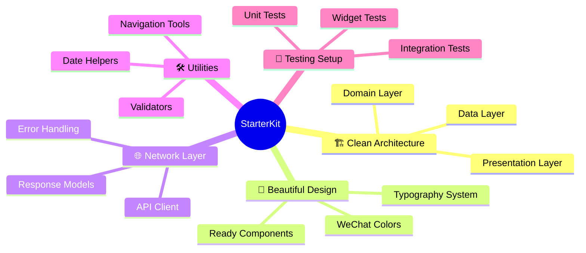
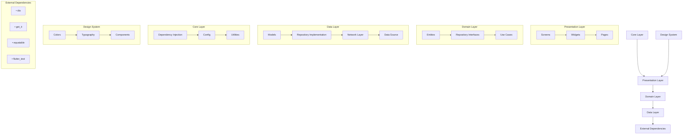
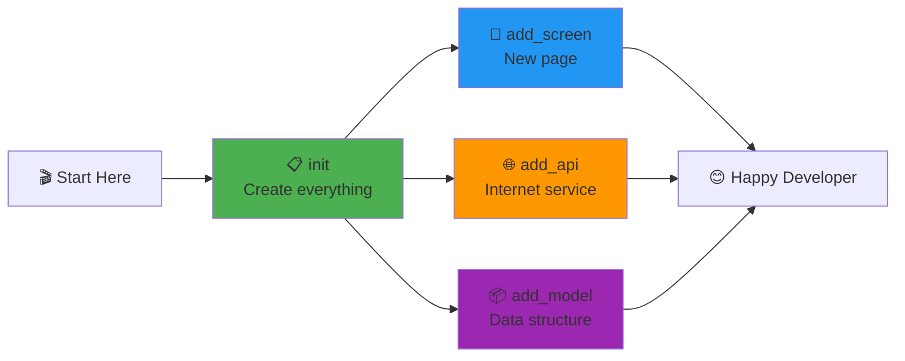
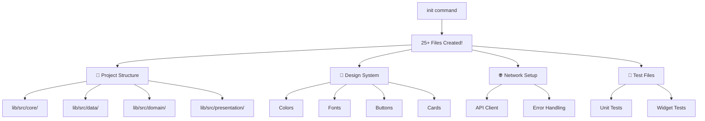

# 🚀 StarterKit - Next-Gen Flutter Boilerplate Generator

<div align="center">
  
  
  
  
</div>

<div align="center">
  <h3>🎯 Eliminate boilerplate. Accelerate development. Build faster.</h3>
  <p>A comprehensive Flutter package that generates production-ready boilerplate with clean architecture, beautiful design system, and essential utilities in seconds.</p>
</div>

---

## 📋 Table of Contents

1. [🌟 Overview](#-overview)
2. [✨ Key Features](#-key-features)
3. [🏗️ Architecture & Flow](#️-architecture--flow)
4. [📦 Installation](#-installation)
5. [🚀 Quick Start](#-quick-start)
6. [🛠️ CLI Commands](#️-cli-commands)
7. [🎨 Design System](#-design-system)
8. [🌐 Network Layer](#-network-layer)
9. [🛠️ Utilities](#️-utilities)
10. [📂 Project Structure](#-project-structure)
11. [🧪 Testing](#-testing)
12. [📱 Examples](#-examples)
13. [🔧 Configuration](#-configuration)
14. [📊 Performance](#-performance)
15. [🤝 Contributing](#-contributing)
16. [📄 License](#-license)

---

## 🌟 Overview

**StarterKit** is a revolutionary Flutter package designed to eliminate the repetitive setup phase of Flutter projects. With a single command, generate a complete, production-ready boilerplate that follows industry best practices and clean architecture principles.

## 🎯 What You Get

When you use StarterKit, you instantly get:


```mermaid
mindmap
  root((StarterKit))
    🏗️ Clean Architecture
      Domain Layer
      Data Layer  
      Presentation Layer
    🎨 Beautiful Design
      WeChat Colors
      Typography System
      Ready Components
    🌐 Network Layer
      API Client
      Error Handling
      Response Models
    🛠️ Utilities
      Validators
      Date Helpers
      Navigation Tools
    🧪 Testing Setup
      Unit Tests
      Widget Tests
      Integration Tests
```

### 🎯 Problem Statement

| Traditional Setup | StarterKit Solution |
|------------------|-------------------|
| ⏰ Hours of boilerplate setup | ⚡ Seconds with CLI commands |
| 🔧 Manual architecture setup | 🏗️ Clean architecture included |
| 🎨 Design system from scratch | 🎨 WeChat-inspired design system |
| 🌐 Network layer implementation | 🌐 Complete API client ready |
| 🧪 Test structure creation | 🧪 Comprehensive test framework |
| 📱 Component library building | 📱 Production-ready components |

### 🎖️ What Makes StarterKit Special

- **🚀 Instant Setup**: Generate complete boilerplate in seconds
- **🏗️ Clean Architecture**: Domain-driven design out of the box
- **🎨 Beautiful Design**: WeChat-inspired design system
- **🧪 Test-Ready**: Comprehensive testing structure
- **📱 Production-Ready**: Industry best practices included
- **🔧 Highly Configurable**: Customizable to your needs

---

## ✨ Key Features

<table>
<tr>
<th>🏗️ Architecture</th>
<th>🎨 Design System</th>
<th>🛠️ Development Tools</th>
</tr>
<tr>
<td>

- **Clean Architecture** (Domain/Data/Presentation)
- **Dependency Injection** with GetIt
- **Repository Pattern**
- **Entity-Model Separation**
- **SOLID Principles**

</td>
<td>

- **WeChat-Inspired Colors**
- **Typography Scale**
- **Reusable Components**
- **Consistent Theming**
- **Material Design 3**

</td>
<td>

- **CLI Code Generation**
- **Hot Module Replacement**
- **Comprehensive Logging**
- **Error Handling**
- **Performance Monitoring**

</td>
</tr>
</table>

<table>
<tr>
<th>🌐 Network Layer</th>
<th>🧪 Testing</th>
<th>🌍 Localization</th>
</tr>
<tr>
<td>

- **API Client with Dio**
- **Response Models**
- **Error Handling**
- **Timeout Management**
- **Interceptors**

</td>
<td>

- **Unit Tests**
- **Widget Tests**
- **Integration Tests**
- **Mock Implementations**
- **Test Utilities**

</td>
<td>

- **Multi-language Support**
- **RTL Support Ready**
- **Dynamic Locale Switching**
- **Pluralization**
- **Date/Number Formatting**

</td>
</tr>
</table>


---

## 🏗️ Architecture & Flow

### 🔄 Data Flow


```mermaid
graph TD

    %% High-Level Layer Flow
    Presentation["Presentation Layer"]
    Domain["Domain Layer"]
    Data["Data Layer"]
    Core["Core Layer"]
    DesignSystem["Design System"]
    External["External Dependencies"]

    Presentation --> Domain
    Domain --> Data
    Data --> External
    Core --> Presentation
    DesignSystem --> Presentation

    %% Presentation Layer Details
    subgraph Presentation Layer
        Screens["Screens"]
        Widgets["Widgets"]
        Pages["Pages"]
    end
    Screens --> Widgets --> Pages

    %% Domain Layer Details
    subgraph Domain Layer
        Entities["Entities"]
        UseCases["Use Cases"]
        RepositoryInterfaces["Repository Interfaces"]
    end
    Entities --> RepositoryInterfaces --> UseCases

    %% Data Layer Details
    subgraph Data Layer
        Models["Models"]
        RepositoryImpl["Repository Implementation"]
        Network["Network Layer"]
        DataSource["Data Source"]
    end
    Models --> RepositoryImpl --> Network --> DataSource

    %% Core Layer Details
    subgraph Core Layer
        DI["Dependency Injection"]
        Config["Config"]
        Utilities["Utilities"]
    end
    DI --> Config --> Utilities

    %% Design System Details
    subgraph Design System
        Colors["Colors"]
        Typography["Typography"]
        Components["Components"]
    end
    Colors --> Typography --> Components

    %% External Dependencies
    subgraph External Dependencies
        Dio["• dio"]
        GetIt["• get_it"]
        Equatable["• equatable"]
        FlutterTest["• flutter_test"]
    end

```


### 🏛️ Dependency Flow

| Layer | Dependencies | Responsibility |
|-------|-------------|----------------|
| **Presentation** | Domain + Core | UI logic, state management, user interactions |
| **Domain** | Core only | Business logic, entities, repository interfaces |
| **Data** | Domain + Core | Data access, API calls, model transformations |
| **Core** | External packages | Configuration, utilities, design system |

---

### ⚡ Quick Installation

```bash
# Step 1: Add dependency
flutter pub add starter_kit

# Step 2: Get packages
flutter pub get

# Step 3: Generate boilerplate
dart run starter_kit init

# Step 4: Run your app
flutter run
```

---

## 🚀 Quick Start

StarterKit gives you 4 magic commands:


```mermaid
flowchart LR
    A[🎬 Start Here] --> B[📋 init<br/>Create everything]
    B --> C[📱 add_screen<br/>New page]
    B --> D[🌐 add_api<br/>Internet service]  
    B --> E[📦 add_model<br/>Data structure]
    
    C --> F[😊 Happy Developer]
    D --> F
    E --> F
    
    style B fill:#4caf50
    style C fill:#2196f3
    style D fill:#ff9800
    style E fill:#9c27b0
```

### 1. `init` - The Magic Command ✨

```bash
dart run starter_kit init
```

**What it creates:**


```mermaid
graph TD
    A[init command] --> B[25+ Files Created!]
    B --> C[📂 Project Structure]
    B --> D[🎨 Design System]
    B --> E[🌐 Network Setup]
    B --> F[🧪 Test Files]
    
    C --> C1[lib/src/core/]
    C --> C2[lib/src/data/]
    C --> C3[lib/src/domain/]
    C --> C4[lib/src/presentation/]
    
    D --> D1[Colors]
    D --> D2[Fonts]
    D --> D3[Buttons]
    D --> D4[Cards]
    
    E --> E1[API Client]
    E --> E2[Error Handling]
    
    F --> F1[Unit Tests]
    F --> F2[Widget Tests]
```

### 2. `add_screen` - Create New Pages 📱

```bash
dart run starter_kit add_screen LoginScreen
```

**Creates:**
- ✅ LoginScreen widget
- ✅ LoginScreen test file

### 3. `add_api` - Internet Services 🌐

```bash
dart run starter_kit add_api UserService
```

**Creates:**
- ✅ API service for internet calls
- ✅ Repository pattern (fancy way to organize code)
- ✅ Test files

### 4. `add_model` - Data Structures 📦

```bash
dart run starter_kit add_model User
```

**Creates:**
- ✅ User model (data structure)
- ✅ JSON conversion (turns internet data into app data)
- ✅ Test files

### 📋 Command Details

| Command | What it creates | Files generated | Example |
|---------|----------------|-----------------|---------|
| **`init`** | Complete boilerplate | 25+ files | `dart run starter_kit init` |
| **`add_screen`** | Screen + widget test | 2 files | `dart run starter_kit add_screen LoginScreen` |
| **`add_api`** | API service + tests | 3 files | `dart run starter_kit add_api UserService` |
| **`add_model`** | Model + entity + test | 3 files | `dart run starter_kit add_model User` |


### 🏗️ init - Complete Boilerplate Generation

```bash
dart run starter_kit init
```

**Generated Structure:**
```
📦 Your Project
├── 📂 lib/src/
│   ├── 📂 core/                    # Core functionality
│   │   ├── 📂 config/              # App configuration
│   │   ├── 📂 design_system/       # Design system
│   │   ├── 📂 di/                  # Dependency injection
│   │   ├── 📂 localization/        # Multi-language support
│   │   ├── 📂 network/             # API client
│   │   └── 📂 utils/               # Utilities
│   ├── 📂 data/                    # Data layer
│   │   ├── 📂 models/              # Data models
│   │   └── 📂 repositories/        # Repository implementations
│   ├── 📂 domain/                  # Domain layer
│   │   ├── 📂 entities/            # Domain entities
│   │   └── 📂 repositories/        # Repository interfaces
│   └── 📂 presentation/            # Presentation layer
│       ├── 📂 pages/               # Screen widgets
│       └── 📂 widgets/             # Reusable widgets
├── 📂 test/                        # Test structure
│   ├── 📂 unit/                    # Unit tests
│   ├── 📂 widget/                  # Widget tests
│   └── 📂 integration/             # Integration tests
└── 📂 assets/                      # Asset folders
    ├── 📂 icons/
    ├── 📂 images/
    └── 📂 fonts/
```

### 📱 add_screen - Screen Generation

```bash
dart run starter_kit add_screen LoginScreen
```

**Generates:**
1. **Screen Widget** (`lib/src/presentation/pages/login_screen.dart`)
2. **Widget Test** (`test/widget/login_screen_test.dart`)

**Example Generated Screen:**
```dart
import 'package:flutter/material.dart';
import 'package:starter_kit/starter_kit.dart';

class LoginScreen extends StatefulWidget {
  const LoginScreen({super.key});

  @override
  State<LoginScreen> createState() => _LoginScreenState();
}

class _LoginScreenState extends State<LoginScreen> {
  @override
  Widget build(BuildContext context) {
    return Scaffold(
      appBar: AppBar(title: Text('Login')),
      body: Center(
        child: Text('Login Screen'),
      ),
    );
  }
}
```

### 🌐 add_api - API Service Generation

```bash
dart run starter_kit add_api UserService
```

**Generates:**
1. **Repository Implementation** (`lib/src/data/repositories/user_repository.dart`)
2. **Repository Interface** (`lib/src/domain/repositories/user_repository.dart`)
3. **Unit Test** (`test/unit/user_repository_test.dart`)

**Generated Repository Pattern:**

```dart
// Domain Interface
abstract class IUserServiceRepository {
  Future<ApiResponse<List<Map<String, dynamic>>>> getAll();
  Future<ApiResponse<Map<String, dynamic>>> getById(String id);
  Future<ApiResponse<Map<String, dynamic>>> create(Map<String, dynamic> data);
  Future<ApiResponse<Map<String, dynamic>>> update(String id, Map<String, dynamic> data);
  Future<ApiResponse<void>> delete(String id);
}

// Data Implementation
class UserServiceRepositoryImpl implements IUserServiceRepository {
  final ApiClient _apiClient;
  
  UserServiceRepositoryImpl(this._apiClient);
  
  @override
  Future<ApiResponse<List<Map<String, dynamic>>>> getAll() async {
    return await _apiClient.get('/users');
  }
  
  // ... other methods
}
```

### 📦 add_model - Model Generation

```bash
dart run starter_kit add_model User
```

**Generates:**
1. **Data Model** (`lib/src/data/models/user.dart`)
2. **Domain Entity** (`lib/src/domain/entities/user.dart`)
3. **Model Test** (`test/unit/user_test.dart`)

**Generated Model with JSON Serialization:**

```dart
import 'package:equatable/equatable.dart';

class User extends Equatable {
  final String id;
  final String name;
  final DateTime createdAt;
  final DateTime updatedAt;

  const User({
    required this.id,
    required this.name,
    required this.createdAt,
    required this.updatedAt,
  });

  factory User.fromJson(Map<String, dynamic> json) {
    return User(
      id: json['id'] as String,
      name: json['name'] as String,
      createdAt: DateTime.parse(json['createdAt'] as String),
      updatedAt: DateTime.parse(json['updatedAt'] as String),
    );
  }

  Map<String, dynamic> toJson() {
    return {
      'id': id,
      'name': name,
      'createdAt': createdAt.toIso8601String(),
      'updatedAt': updatedAt.toIso8601String(),
    };
  }

  @override
  List<Object?> get props => [id, name, createdAt, updatedAt];
}
```

### 🎯 Command Chaining Example

```bash
# Initialize project
dart run starter_kit init

# Generate complete authentication flow
dart run starter_kit add_screen LoginScreen
dart run starter_kit add_screen SignupScreen
dart run starter_kit add_api AuthService
dart run starter_kit add_model User

# Generate e-commerce features
dart run starter_kit add_screen ProductListScreen
dart run starter_kit add_screen ProductDetailScreen
dart run starter_kit add_api ProductService
dart run starter_kit add_model Product
```

---

## 🎨 Design System

### 🎨 WeChat-Inspired Color Palette

StarterKit includes a comprehensive color system inspired by WeChat's clean and modern design language.

<table>
<tr>
<th>Color Category</th>
<th>Colors</th>
<th>Usage</th>
<th>Example</th>
</tr>
<tr>
<td><strong>🎯 Primary</strong></td>
<td>

```dart
AppColors.primary        // #07C160
AppColors.primaryDark    // #05A050  
AppColors.primaryLight   // #4CD98B
```

</td>
<td>Main actions, CTAs, navigation</td>
<td>Submit buttons, active states</td>
</tr>
<tr>
<td><strong>🔵 Secondary</strong></td>
<td>

```dart
AppColors.secondary      // #576B95
AppColors.secondaryDark  // #3F5177
AppColors.secondaryLight // #7A8BB5
```

</td>
<td>Secondary actions, info</td>
<td>Cancel buttons, info badges</td>
</tr>
<tr>
<td><strong>⚫ Neutral</strong></td>
<td>

```dart
AppColors.white          // #FFFFFF
AppColors.black          // #000000
AppColors.background     // #F7F7F7
AppColors.surface        // #FFFFFF
```

</td>
<td>Backgrounds, surfaces</td>
<td>Cards, modals, screens</td>
</tr>
<tr>
<td><strong>📝 Text</strong></td>
<td>

```dart
AppColors.textPrimary    // #1A1A1A
AppColors.textSecondary  // #8C8C8C
AppColors.textTertiary   // #BFBFBF
AppColors.textDisabled   // #D9D9D9
```

</td>
<td>Text hierarchy</td>
<td>Headings, body, captions</td>
</tr>
<tr>
<td><strong>🚦 Status</strong></td>
<td>

```dart
AppColors.success        // #52C41A
AppColors.warning        // #FAAD14
AppColors.error          // #F5222D
AppColors.info           // #1890FF
```

</td>
<td>Feedback, alerts</td>
<td>Success messages, errors</td>
</tr>
</table>

### 📝 Typography System

Complete typography scale following Material Design principles:

| Style | Size | Weight | Usage | Example |
|-------|------|--------|-------|---------|
| **h1** | 32px | Bold | Page titles | `AppTextStyles.h1` |
| **h2** | 28px | Bold | Section headers | `AppTextStyles.h2` |
| **h3** | 24px | SemiBold | Subsection titles | `AppTextStyles.h3` |
| **h4** | 20px | SemiBold | Card titles | `AppTextStyles.h4` |
| **h5** | 18px | SemiBold | List headers | `AppTextStyles.h5` |
| **h6** | 16px | SemiBold | Small headers | `AppTextStyles.h6` |
| **bodyLarge** | 16px | Regular | Main content | `AppTextStyles.bodyLarge` |
| **bodyMedium** | 14px | Regular | Secondary content | `AppTextStyles.bodyMedium` |
| **bodySmall** | 12px | Regular | Supporting text | `AppTextStyles.bodySmall` |
| **button** | 14px | Medium | Button text | `AppTextStyles.button` |
| **caption** | 10px | Regular | Captions, footnotes | `AppTextStyles.caption` |

### 🧩 Component Library

#### 🔘 Button Components

<table>
<tr>
<th>Component</th>
<th>Purpose</th>
<th>Example</th>
</tr>
<tr>
<td><strong>PrimaryButton</strong></td>
<td>Main actions</td>
<td>

```dart
PrimaryButton(
  text: 'Save Changes',
  icon: Icons.save,
  onPressed: () => save(),
  isLoading: isLoading,
  fullWidth: true,
)
```

</td>
</tr>
<tr>
<td><strong>SecondaryButton</strong></td>
<td>Secondary actions</td>
<td>

```dart
SecondaryButton(
  text: 'Cancel',
  icon: Icons.close,
  onPressed: () => cancel(),
)
```

</td>
</tr>
</table>

#### 📝 Input Components

| Component | Features | Usage |
|-----------|----------|-------|
| **AppTextField** | Validation, icons, theming | Text input with built-in validation |
| **AppDropdown** | Custom styling, search | Dropdown selections |
| **AppDatePicker** | Locale support, validation | Date/time selection |

```dart
AppTextField(
  labelText: 'Email Address',
  hintText: 'Enter your email',
  prefixIcon: Icons.email,
  validator: Validators.email,
  keyboardType: TextInputType.emailAddress,
)
```

#### 🃏 Card Components

```dart
AppCard(
  child: Column(
    children: [
      Text('Card Title', style: AppTextStyles.h5),
      Text('Card content goes here'),
    ],
  ),
)
```

---

## 🌐 Network Layer

### 🔄 API Client Architecture

```
┌─────────────────┐    ┌─────────────────┐    ┌─────────────────┐
│   Repository    │────│   API Client    │────│   HTTP Client   │
│   (Business)    │    │   (Wrapper)     │    │     (Dio)       │
└─────────────────┘    └─────────────────┘    └─────────────────┘
         │                       │                       │
         ▼                       ▼                       ▼
┌─────────────────┐    ┌─────────────────┐    ┌─────────────────┐
│  Domain Models  │    │  Error Handling │    │   Interceptors  │
│   (Entities)    │    │   (Responses)   │    │   (Logging)     │
└─────────────────┘    └─────────────────┘    └─────────────────┘
```

### 📡 API Response Handling

StarterKit includes a robust response wrapper system:

```dart
class ApiResponse<T> {
  final T? data;
  final String? errorMessage;
  final bool isSuccess;
  
  // Factory constructors
  factory ApiResponse.success(T data);
  factory ApiResponse.error(String message);
  
  // Utility getters
  bool get hasData => data != null;
  bool get hasError => errorMessage != null;
}
```

### 🔧 Usage Examples

#### Basic API Calls

```dart
// GET request
final response = await apiClient.get<List<User>>('/users');
if (response.isSuccess) {
  final users = response.data;
  // Handle success
} else {
  // Handle error: response.errorMessage
}

// POST request with data
final response = await apiClient.post<User>(
  '/users', 
  data: {'name': 'John', 'email': 'john@example.com'}
);
```

#### Error Handling Matrix

| Error Type | HTTP Code | StarterKit Response | User Action |
|------------|-----------|-------------------|-------------|
| **Network Error** | - | "No internet connection" | Check connection |
| **Timeout** | - | "Connection timeout" | Retry request |
| **Unauthorized** | 401 | "Authentication required" | Login again |
| **Forbidden** | 403 | "Access denied" | Contact support |
| **Not Found** | 404 | "Resource not found" | Check URL |
| **Server Error** | 500+ | "Server error occurred" | Try again later |

### ⚙️ Configuration

```dart
class AppConfig {
  static const String apiBaseUrl = 'https://api.example.com';
  static const int apiTimeout = 30000;
  static const bool isDebug = true;
  
  static Map<String, String> get defaultHeaders => {
    'Content-Type': 'application/json',
    'Accept': 'application/json',
    'User-Agent': 'MyApp/1.0.0',
  };
}
```

---

## 🛠️ Utilities

### 🔤 String Utilities

| Method | Input | Output | Purpose |
|--------|-------|--------|---------|
| `capitalize()` | "hello world" | "Hello world" | Capitalize first letter |
| `toCamelCase()` | "hello world" | "helloWorld" | Convert to camelCase |
| `toSnakeCase()` | "HelloWorld" | "hello_world" | Convert to snake_case |
| `truncate()` | "Long text...", 10 | "Long te..." | Truncate with ellipsis |
| `isEmail()` | "test@example.com" | true | Email validation |
| `isPhoneNumber()` | "+1234567890" | true | Phone validation |
| `isUrl()` | "https://example.com" | true | URL validation |

### 📅 Date Utilities

<table>
<tr>
<th>Method</th>
<th>Example Input</th>
<th>Example Output</th>
<th>Use Case</th>
</tr>
<tr>
<td><code>formatDate()</code></td>
<td>DateTime.now()</td>
<td>"Mar 15, 2024"</td>
<td>Display dates</td>
</tr>
<tr>
<td><code>formatRelativeTime()</code></td>
<td>1 hour ago</td>
<td>"1 hour ago"</td>
<td>Social media timestamps</td>
</tr>
<tr>
<td><code>isToday()</code></td>
<td>DateTime.now()</td>
<td>true</td>
<td>Date comparisons</td>
</tr>
<tr>
<td><code>formatDuration()</code></td>
<td>Duration(hours: 2, minutes: 30)</td>
<td>"2h 30m"</td>
<td>Time intervals</td>
</tr>
</table>

### ✅ Validation System

#### Form Validation Matrix

| Field Type | Validator | Rules | Error Message |
|------------|-----------|-------|---------------|
| **Email** | `Validators.email` | RFC 5322 compliant | "Enter a valid email address" |
| **Password** | `Validators.password` | Min 8 chars, mixed case, numbers | "Password must contain uppercase, lowercase, and number" |
| **Phone** | `Validators.phone` | International format | "Enter a valid phone number" |
| **Required** | `Validators.required` | Non-empty | "{fieldName} is required" |
| **Min Length** | `Validators.minLength` | Character count | "{fieldName} must be at least {count} characters" |
| **Max Length** | `Validators.maxLength` | Character count | "{fieldName} must not exceed {count} characters" |
| **URL** | `Validators.url` | HTTP/HTTPS protocol | "Enter a valid URL" |
| **Numeric** | `Validators.numeric` | Numbers only | "{fieldName} must be a number" |

#### Validation Usage Examples

```dart
// Simple email validation
TextFormField(
  validator: Validators.email,
  keyboardType: TextInputType.emailAddress,
)

// Password with custom field name
TextFormField(
  validator: (value) => Validators.minLength(value, 8, fieldName: 'Password'),
  obscureText: true,
)

// Combined validation
TextFormField(
  validator: (value) {
    // Multiple validations
    final required = Validators.required(value, fieldName: 'Username');
    if (required != null) return required;
    
    return Validators.minLength(value, 3, fieldName: 'Username');
  },
)
```

### 🧭 Navigation Utilities

StarterKit provides a comprehensive navigation system:

| Method | Purpose | Example |
|--------|---------|---------|
| `push()` | Navigate to new screen | `NavigationUtils.push(LoginScreen())` |
| `pushNamed()` | Navigate by route name | `NavigationUtils.pushNamed('/login')` |
| `pushReplacement()` | Replace current screen | `NavigationUtils.pushReplacement(HomeScreen())` |
| `pushAndClearStack()` | Clear navigation stack | `NavigationUtils.pushAndClearStack(LoginScreen())` |
| `pop()` | Go back | `NavigationUtils.pop()` |
| `showSnackBar()` | Show snackbar | `NavigationUtils.showSnackBar(message: 'Success!')` |
| `showAlertDialog()` | Show dialog | `NavigationUtils.showAlertDialog(title: 'Confirm', content: 'Are you sure?')` |

### 📱 Device Utilities

<table>
<tr>
<th>Category</th>
<th>Methods</th>
<th>Purpose</th>
</tr>
<tr>
<td><strong>Device Info</strong></td>
<td>

```dart
getDeviceId()
getDeviceName()
getOsVersion()
getAppVersion()
```

</td>
<td>Device identification and metadata</td>
</tr>
<tr>
<td><strong>Platform Detection</strong></td>
<td>

```dart
isMobile()
isDesktop()
isWeb()
isIOS()
isAndroid()
```

</td>
<td>Platform-specific logic</td>
</tr>
<tr>
<td><strong>UI Utilities</strong></td>
<td>

```dart
hideKeyboard()
isKeyboardVisible()
getScreenSize()
isTablet()
vibrate()
```

</td>
<td>UI interactions and feedback</td>
</tr>
</table>

---

## 📂 Project Structure

### 🏗️ Generated Directory Tree

```
📦 your_flutter_project/
├── 📂 lib/
│   ├── 📄 starter_kit.dart                 # Main exports
│   └── 📂 src/
│       ├── 📂 core/                        # Core functionality
│       │   ├── 📂 config/
│       │   │   └── 📄 app_config.dart      # App configuration
│       │   ├── 📂 design_system/
│       │   │   ├── 📄 design_system.dart   # Export file
│       │   │   ├── 📂 components/
│       │   │   │   ├── 📄 app_buttons.dart
│       │   │   │   ├── 📄 app_text_inputs.dart
│       │   │   │   └── 📄 app_cards.dart
│       │   │   └── 📂 theme/
│       │   │       ├── 📄 colors.dart
│       │   │       ├── 📄 typography.dart
│       │   │       └── 📄 theme.dart
│       │   ├── 📂 di/
│       │   │   └── 📄 di.dart              # Dependency injection
│       │   ├── 📂 localization/
│       │   │   └── 📄 app_localizations.dart
│       │   ├── 📂 network/
│       │   │   └── 📄 api_client.dart      # HTTP client
│       │   └── 📂 utils/
│       │       ├── 📄 utils.dart           # Export file
│       │       ├── 📄 string_utils.dart
│       │       ├── 📄 date_utils.dart
│       │       ├── 📄 validators.dart
│       │       ├── 📄 navigation_utils.dart
│       │       ├── 📄 logger.dart
│       │       └── 📄 device_utils.dart
│       ├── 📂 data/                        # Data layer
│       │   ├── 📂 models/
│       │   │   └── 📄 api_response.dart    # Response wrapper
│       │   └── 📂 repositories/
│       │       └── 📄 (generated_repos)    # Repository implementations
│       ├── 📂 domain/                      # Domain layer
│       │   ├── 📂 entities/
│       │   │   └── 📄 (generated_entities) # Domain entities
│       │   └── 📂 repositories/
│       │       └── 📄 (generated_interfaces) # Repository interfaces
│       └── 📂 presentation/                # Presentation layer
│           ├── 📂 pages/
│           │   └── 📄 (generated_screens)  # Screen widgets
│           └── 📂 widgets/
│               └── 📄 (reusable_widgets)   # Shared widgets
├── 📂 test/                               # Test structure
│   ├── 📂 unit/
│   │   └── 📄 (generated_unit_tests)      # Unit tests
│   ├── 📂 widget/
│   │   └── 📄 (generated_widget_tests)    # Widget tests
│   └── 📂 integration/
│       └── 📄 (integration_tests)         # E2E tests
├── 📂 assets/                             # Asset directories
│   ├── 📂 icons/
│   ├── 📂 images/
│   └── 📂 fonts/
├── 📄 pubspec.yaml                        # Dependencies
└── 📄 README.md                          # Project documentation
```

### 📊 File Generation Summary

| Command | Generated Files | Purpose |
|---------|----------------|---------|
| `init` | 25+ files | Complete boilerplate setup |
| `add_screen` | 2 files | Screen + test |
| `add_api` | 3 files | Repository pattern + test |
| `add_model` | 3 files | Model + entity + test |

---

## 🧪 Testing

### 🎯 Testing Strategy

StarterKit generates a comprehensive test structure following Flutter best practices:

```
📂 test/
├── 📂 unit/                    # Business logic tests
├── 📂 widget/                  # UI component tests  
└── 📂 integration/             # End-to-end tests
```

### 📋 Test Coverage Matrix

| Test Type | Coverage | Examples | Purpose |
|-----------|----------|----------|---------|
| **Unit Tests** | Business Logic | Validators, Utils, Repositories | Logic verification |
| **Widget Tests** | UI Components | Screens, Widgets | UI behavior testing |
| **Integration Tests** | Full Features | User flows | End-to-end validation |

### 🧪 Generated Test Examples

#### Unit Test Example

```dart
// test/unit/string_utils_test.dart
import 'package:flutter_test/flutter_test.dart';
import 'package:starter_kit/src/core/utils/string_utils.dart';

void main() {
  group('StringUtils', () {
    test('should capitalize string correctly', () {
      expect(StringUtils.capitalize('hello'), 'Hello');
      expect(StringUtils.capitalize('HELLO'), 'Hello');
      expect(StringUtils.capitalize(''), '');
    });

    test('should validate email correctly', () {
      expect(StringUtils.isEmail('test@example.com'), true);
      expect(StringUtils.isEmail('invalid-email'), false);
    });
  });
}
```

#### Widget Test Example

```dart
// test/widget/login_screen_test.dart
import 'package:flutter/material.dart';
import 'package:flutter_test/flutter_test.dart';
import 'package:starter_kit/src/presentation/pages/login_screen.dart';

void main() {
  group('LoginScreen Tests', () {
    testWidgets('should display login form', (tester) async {
      await tester.pumpWidget(
        MaterialApp(home: LoginScreen()),
      );
      
      expect(find.text('Login'), findsOneWidget);
      expect(find.byType(TextFormField), findsWidgets);
      expect(find.byType(ElevatedButton), findsOneWidget);
    });
  });
}
```

### ⚡ Running Tests

```bash
# Run all tests
flutter test

# Run specific test file
flutter test test/unit/string_utils_test.dart

# Run tests with coverage
flutter test --coverage

# Run widget tests only
flutter test test/widget/

# Run integration tests
flutter test integration_test/
```

---

## 📱 Examples

### 🚀 Complete App Example

Here's how to build a complete authentication flow using StarterKit:

#### Step 1: Generate Components

```bash
# Initialize project
dart run starter_kit init

# Generate screens
dart run starter_kit add_screen LoginScreen
dart run starter_kit add_screen SignupScreen
dart run starter_kit add_screen HomeScreen

# Generate API service
dart run starter_kit add_api AuthService

# Generate models
dart run starter_kit add_model User
dart run starter_kit add_model AuthResponse
```

#### Step 2: Implement Login Screen

```dart
// lib/src/presentation/pages/login_screen.dart
import 'package:flutter/material.dart';
import 'package:starter_kit/starter_kit.dart';

class LoginScreen extends StatefulWidget {
  const LoginScreen({super.key});

  @override
  State<LoginScreen> createState() => _LoginScreenState();
}

class _LoginScreenState extends State<LoginScreen> {
  final _formKey = GlobalKey<FormState>();
  final _emailController = TextEditingController();
  final _passwordController = TextEditingController();
  bool _isLoading = false;

  @override
  Widget build(BuildContext context) {
    return Scaffold(
      appBar: AppBar(
        title: Text('Login', style: AppTextStyles.h4),
        backgroundColor: AppColors.primary,
        foregroundColor: AppColors.white,
      ),
      body: Padding(
        padding: const EdgeInsets.all(24.0),
        child: Form(
          key: _formKey,
          child: Column(
            crossAxisAlignment: CrossAxisAlignment.stretch,
            children: [
              const SizedBox(height: 32),
              
              // Welcome text
              Text(
                'Welcome Back!',
                style: AppTextStyles.h2,
                textAlign: TextAlign.center,
              ),
              const SizedBox(height: 8),
              Text(
                'Sign in to your account',
                style: AppTextStyles.bodyMedium.copyWith(
                  color: AppColors.textSecondary,
                ),
                textAlign: TextAlign.center,
              ),
              
              const SizedBox(height: 48),
              
              // Email field
              AppTextField(
                controller: _emailController,
                labelText: 'Email Address',
                hintText: 'Enter your email',
                prefixIcon: Icons.email,
                keyboardType: TextInputType.emailAddress,
                validator: Validators.email,
              ),
              
              const SizedBox(height: 16),
              
              // Password field
              AppTextField(
                controller: _passwordController,
                labelText: 'Password',
                hintText: 'Enter your password',
                prefixIcon: Icons.lock,
                obscureText: true,
                validator: (value) => Validators.minLength(
                  value, 
                  6, 
                  fieldName: 'Password'
                ),
              ),
              
              const SizedBox(height: 24),
              
              // Login button
              PrimaryButton(
                text: 'Sign In',
                onPressed: _isLoading ? null : _handleLogin,
                isLoading: _isLoading,
                fullWidth: true,
              ),
              
              const SizedBox(height: 16),
              
              // Signup link
              TextButton(
                onPressed: () => NavigationUtils.push(SignupScreen()),
                child: Text('Don\'t have an account? Sign up'),
              ),
            ],
          ),
        ),
      ),
    );
  }

  Future<void> _handleLogin() async {
    if (!_formKey.currentState!.validate()) return;

    setState(() => _isLoading = true);

    try {
      final authService = get<AuthServiceRepositoryImpl>();
      final response = await authService.login({
        'email': _emailController.text,
        'password': _passwordController.text,
      });

      if (response.isSuccess) {
        NavigationUtils.pushAndClearStack(HomeScreen());
        NavigationUtils.showSnackBar(message: 'Login successful!');
      } else {
        NavigationUtils.showSnackBar(message: response.errorMessage ?? 'Login failed');
      }
    } catch (e) {
      NavigationUtils.showSnackBar(message: 'An error occurred: $e');
    } finally {
      setState(() => _isLoading = false);
    }
  }

  @override
  void dispose() {
    _emailController.dispose();
    _passwordController.dispose();
    super.dispose();
  }
}
```

### 🎨 Design System Usage Examples

#### Custom Themed Card

```dart
class FeatureCard extends StatelessWidget {
  final String title;
  final String description;
  final IconData icon;
  final VoidCallback? onTap;

  const FeatureCard({
    super.key,
    required this.title,
    required this.description,
    required this.icon,
    this.onTap,
  });

  @override
  Widget build(BuildContext context) {
    return AppCard(
      onTap: onTap,
      child: Column(
        crossAxisAlignment: CrossAxisAlignment.start,
        children: [
          Row(
            children: [
              Container(
                padding: EdgeInsets.all(8),
                decoration: BoxDecoration(
                  color: AppColors.primary.withOpacity(0.1),
                  borderRadius: BorderRadius.circular(8),
                ),
                child: Icon(
                  icon,
                  color: AppColors.primary,
                  size: 24,
                ),
              ),
              SizedBox(width: 12),
              Expanded(
                child: Text(
                  title,
                  style: AppTextStyles.h5,
                ),
              ),
            ],
          ),
          SizedBox(height: 12),
          Text(
            description,
            style: AppTextStyles.bodyMedium.copyWith(
              color: AppColors.textSecondary,
            ),
          ),
        ],
      ),
    );
  }
}
```

### 🌐 API Integration Example

```dart
// lib/src/data/repositories/auth_repository.dart
class AuthServiceRepositoryImpl implements IAuthServiceRepository {
  final ApiClient _apiClient;
  
  AuthServiceRepositoryImpl(this._apiClient);
  
  @override
  Future<ApiResponse<AuthResponse>> login(Map<String, dynamic> credentials) async {
    try {
      final response = await _apiClient.post<Map<String, dynamic>>(
        '/auth/login',
        data: credentials,
      );
      
      if (response.isSuccess) {
        final authResponse = AuthResponse.fromJson(response.data!);
        return ApiResponse.success(authResponse);
      } else {
        return ApiResponse.error(response.errorMessage ?? 'Login failed');
      }
    } catch (e) {
      return ApiResponse.error('Network error: $e');
    }
  }
  
  @override
  Future<ApiResponse<User>> getProfile() async {
    final response = await _apiClient.get<Map<String, dynamic>>('/auth/profile');
    
    if (response.isSuccess) {
      final user = User.fromJson(response.data!);
      return ApiResponse.success(user);
    } else {
      return ApiResponse.error(response.errorMessage ?? 'Failed to get profile');
    }
  }
}
```

---

## 🔧 Configuration

### ⚙️ Environment Configuration

StarterKit supports multiple environments with easy configuration:

| Environment | Purpose | Configuration |
|-------------|---------|---------------|
| **Development** | Local development | Debug logs, mock data, relaxed validation |
| **Staging** | Testing environment | Production-like, test data, monitoring |
| **Production** | Live application | Optimized, analytics, error reporting |

#### Configuration Setup

```dart
// lib/src/core/config/app_config.dart
class AppConfig {
  static const String appName = 'MyApp';
  static const String appVersion = '1.0.0';
  
  // Environment-specific URLs
  static const String _devApiUrl = 'https://dev-api.example.com';
  static const String _stagingApiUrl = 'https://staging-api.example.com';
  static const String _prodApiUrl = 'https://api.example.com';
  
  static String get apiBaseUrl {
    switch (environment) {
      case 'development':
        return _devApiUrl;
      case 'staging':
        return _stagingApiUrl;
      case 'production':
      default:
        return _prodApiUrl;
    }
  }
  
  static bool get isDebug => environment == 'development';
  static String get environment => const String.fromEnvironment('ENV', defaultValue: 'production');
}
```

#### Environment Initialization

```dart
// main.dart
void main() async {
  WidgetsFlutterBinding.ensureInitialized();
  
  // Initialize with environment
  const environment = String.fromEnvironment('ENV', defaultValue: 'production');
  await configureDependencies(environment: environment);
  
  runApp(MyApp());
}
```

#### Build Commands

```bash
# Development build
flutter run --dart-define=ENV=development

# Staging build
flutter build apk --dart-define=ENV=staging

# Production build
flutter build apk --dart-define=ENV=production
```

### 🎨 Theme Customization

#### Custom Color Scheme

```dart
// Create your own color scheme
class MyAppColors extends AppColors {
  // Override primary colors
  static const Color primary = Color(0xFF6366F1);      // Indigo
  static const Color primaryDark = Color(0xFF4F46E5);   // Indigo dark
  static const Color primaryLight = Color(0xFF818CF8);  // Indigo light
  
  // Add custom colors
  static const Color accent = Color(0xFF10B981);        // Emerald
  static const Color highlight = Color(0xFFF59E0B);     // Amber
}
```

#### Custom Typography

```dart
// Extend typography system
class MyAppTextStyles extends AppTextStyles {
  // Add custom text styles
  static const TextStyle heroTitle = TextStyle(
    fontSize: 48,
    fontWeight: FontWeight.bold,
    color: AppColors.textPrimary,
    height: 1.1,
  );
  
  static const TextStyle price = TextStyle(
    fontSize: 24,
    fontWeight: FontWeight.w600,
    color: AppColors.primary,
  );
}
```

---

### 📈 Benchmarks

```dart
// Performance monitoring example
class PerformanceMonitor {
  static void trackOperation(String name, Function operation) {
    final stopwatch = Stopwatch()..start();
    operation();
    stopwatch.stop();
    AppLogger.performance(name, stopwatch.elapsed);
  }
}

// Usage
PerformanceMonitor.trackOperation('API Call', () async {
  await apiClient.get('/users');
});
```

---

## 🤝 Contributing

### 🌟 How to Contribute

We welcome contributions! Here's how you can help make StarterKit even better:

<table>
<tr>
<th>Contribution Type</th>
<th>How to Help</th>
<th>Impact</th>
</tr>
<tr>
<td><strong>🐛 Bug Reports</strong></td>
<td>Report issues, provide reproduction steps</td>
<td>Improve stability</td>
</tr>
<tr>
<td><strong>✨ Feature Requests</strong></td>
<td>Suggest new CLI commands, components</td>
<td>Enhance functionality</td>
</tr>
<tr>
<td><strong>📝 Documentation</strong></td>
<td>Improve README, add examples</td>
<td>Better developer experience</td>
</tr>
<tr>
<td><strong>🧪 Testing</strong></td>
<td>Add test cases, improve coverage</td>
<td>Higher reliability</td>
</tr>
<tr>
<td><strong>💻 Code</strong></td>
<td>Submit PRs for new features</td>
<td>Core improvements</td>
</tr>
</table>

### 🚀 Development Setup

```bash
# 1. Fork and clone the repository
git clone https://github.com/your-username/starter_kit.git
cd starter_kit

# 2. Install dependencies
flutter pub get

# 3. Run tests
flutter test

# 4. Test CLI commands
dart run bin/starter_kit.dart init
```

### 📋 Contribution Guidelines

1. **🔍 Check existing issues** before creating new ones
2. **🧪 Add tests** for new features
3. **📝 Update documentation** for API changes
4. **🎨 Follow code style** guidelines
5. **✅ Ensure all tests pass** before submitting PR

---

## 📄 License

This project is licensed under the **MIT License** - see the [LICENSE](LICENSE) file for details.

---

<div align="center">

## 🎉 Ready to Build Something Amazing?

<table>
<tr>
<td align="center">
<strong>🚀 Get Started</strong><br/>
<code>dart run starter_kit init</code>
</td>
<td align="center">
<strong>📚 Documentation</strong><br/>
<a href="#-table-of-contents">View Full Docs</a>
</td>
<td align="center">
<strong>💬 Support</strong><br/>
<a href="https://github.com/your-repo/issues">Open Issue</a>
</td>
</tr>
</table>

### 💖 Made with ❤️ for the Flutter Community & ErrorXperts

**Stop writing boilerplate. Start building features.** 🚀

---

<sub>⭐ If StarterKit helped you, please consider giving it a star on GitHub!</sub>

</div>
